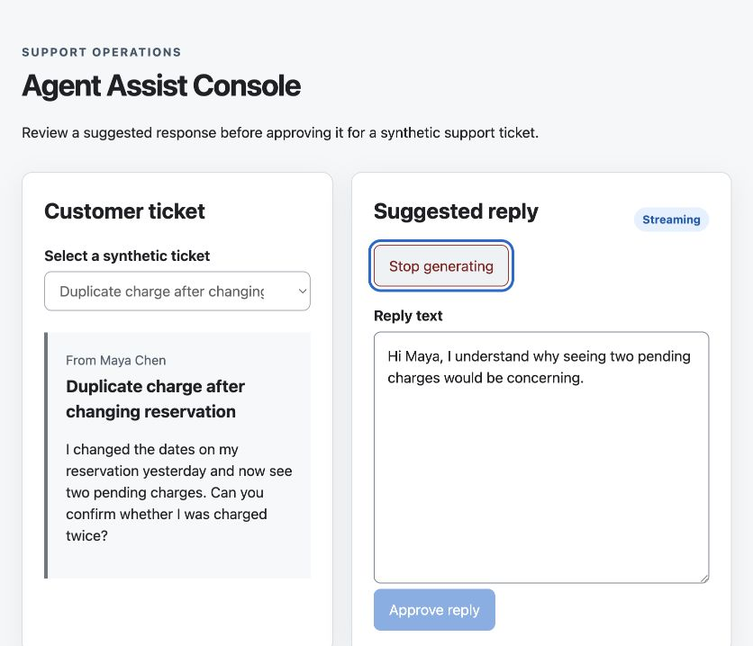
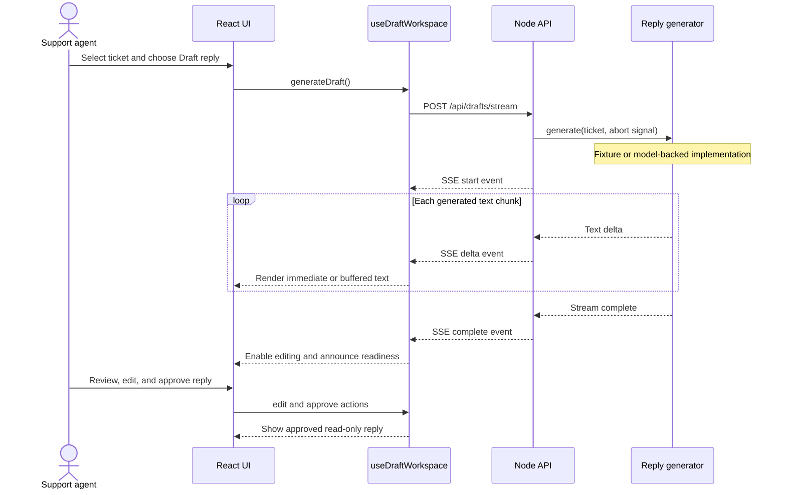
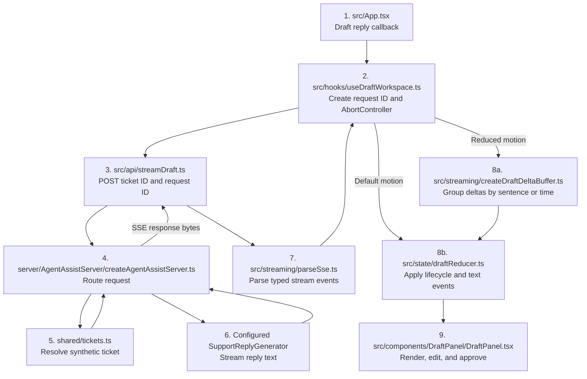

# Accessible Agent-Assist Console

[](https://github.com/KyleSudu/agent-assist-console/actions/workflows/ci.yml)

An independent technical prototype exploring how a support-agent workstation should present streamed generative AI output to keyboard and screen-reader users.

> **Status:** v0 shipped; v1 is in progress. The project uses synthetic data and is an independent learning prototype, not a production service or an official integration with any company or support platform.

## Preview



This is not a general chatbot. It is a narrow human-review workflow: an agent selects a synthetic support ticket, requests a suggested reply, interrupts the generation if needed, edits the result, and approves it.

## The problem

Streaming text creates two different experiences. A visual user can benefit from seeing a draft appear incrementally, but placing those updates in an ARIA live region can make a screen reader announce an unusable stream of partial words and repeated content.

The project tests a deliberate split:

- The visual interface receives incremental draft updates.
- Assistive technology receives concise lifecycle milestones such as “Generating suggested reply” and “Suggestion ready.”
- The Stop action remains keyboard-accessible while generation is active.
- Cancellation retains the partial draft and prevents late events from changing it.
- Completing or stopping a stream does not move focus automatically.

The goal is not merely to call a model API. The goal is to make provisional model output reviewable, interruptible, and understandable.

## Current status

The repository currently contains a working vertical slice:

- Four synthetic customer-support tickets
- A React and strict TypeScript interface
- A separate Node API process
- GraphQL Yoga ticket queries with Apollo Client caching
- Operation types generated from the GraphQL schema and client query
- A typed server-sent event protocol
- Deterministic or model-backed incremental reply generation
- Request cancellation and stale-response protection
- Sentence- and time-buffered visual updates when reduced motion is preferred
- Editing and approval of partial or completed drafts
- Milestone-only screen-reader status messages
- Unit tests for reducer behavior, stream parsing, and ticket selection
- Chrome end-to-end coverage for the critical draft-review journey
- Keyboard/focus tests and axe-core audits of the loaded, ready, and approved states

The deterministic generator remains the default. It makes the interaction reproducible and keeps routine development and automated tests independent of external services. Anthropic and OpenAI adapters can be selected explicitly for model-backed generation.

## Architecture

```text
React interface
  -> Apollo Client
     -> POST /graphql
     -> GraphQL Yoga
     -> ticket resolver
     -> synthetic ticket source
  -> streaming fetch client
     -> POST /api/drafts/stream
     -> typed SSE parser
     -> reducer-driven draft state

Node API
  -> validates the ticket and request id
  -> support reply generator
     -> deterministic fixture implementation (default)
     -> prompt builder + streaming text model
        -> Anthropic adapter
        -> OpenAI Responses API adapter
  -> emits start, delta, complete, or error events
```

### Happy-path request flow



This is the critical user journey covered by the Cypress test. Cancellation and provider-error paths branch from the streaming portion and retain any usable partial draft.

### Code-level request trace

The server selects and injects its reply generator once at startup:

```text
server/index.ts
  -> server/config.ts
  -> server/supportReplies/createConfiguredSupportReplyGenerator.ts
  -> server/supportReplies/selectSupportReplyGenerator.ts
  -> fixture generator or model-backed generator + provider adapter
  -> server/AgentAssistServer/createAgentAssistServer.ts
```

After that composition step, one click on **Draft reply** follows this runtime path:



| Step | File                                                                                                                             | Responsibility                                                                           |
| ---- | -------------------------------------------------------------------------------------------------------------------------------- | ---------------------------------------------------------------------------------------- |
| 1    | [`src/App.tsx`](src/App.tsx)                                                                                                     | Connects the draft-panel action to the workspace hook.                                   |
| 2    | [`src/hooks/useDraftWorkspace.ts`](src/hooks/useDraftWorkspace.ts)                                                               | Owns request identity, cancellation, event handling, and review actions.                 |
| 3    | [`src/api/streamDraft.ts`](src/api/streamDraft.ts)                                                                               | Sends the POST request and reads the streaming response body.                            |
| 4    | [`server/AgentAssistServer/createAgentAssistServer.ts`](server/AgentAssistServer/createAgentAssistServer.ts)                     | Routes the request to GraphQL or the draft-stream handler.                               |
| 5    | [`shared/tickets.ts`](shared/tickets.ts)                                                                                         | Resolves the synthetic ticket named by the request.                                      |
| 6a   | [`server/supportReplies/Fixture/FixtureSupportReplyGenerator.ts`](server/supportReplies/Fixture/FixtureSupportReplyGenerator.ts) | Produces deterministic local chunks in fixture mode.                                     |
| 6b   | [`server/supportReplies/modelSupportReplyGenerator.ts`](server/supportReplies/modelSupportReplyGenerator.ts)                     | Builds the support prompt and delegates remote generation to the selected model adapter. |
| 7    | [`src/streaming/parseSse.ts`](src/streaming/parseSse.ts)                                                                         | Turns arbitrary network chunks into typed application events.                            |
| 8a   | [`src/streaming/createDraftDeltaBuffer.ts`](src/streaming/createDraftDeltaBuffer.ts)                                             | Reduces visual update frequency when reduced motion is preferred.                        |
| 8b   | [`src/state/draftReducer.ts`](src/state/draftReducer.ts)                                                                         | Applies stream, edit, stop, error, and approval transitions.                             |
| 9    | [`src/components/DraftPanel/DraftPanel.tsx`](src/components/DraftPanel/DraftPanel.tsx)                                           | Renders the current state and exposes editing and approval controls.                     |

The remote branch also passes through [`buildDraftPrompt.ts`](server/supportReplies/buildDraftPrompt.ts) and then either the [OpenAI](server/models/OpenAI/OpenAIStreamingTextModel.ts) or [Anthropic](server/models/Anthropic/AnthropicStreamingTextModel.ts) adapter. Both return the same provider-neutral stream of text chunks to the server.

The stream uses an HTTP `POST` with an SSE-formatted response. The browser reads it through `fetch()` and `ReadableStream` rather than `EventSource`, because the request includes a ticket payload.

GraphQL and Apollo handle structured, cacheable ticket data. GraphQL is intentionally not used for token deltas: high-frequency generation updates remain on the streaming transport instead of repeatedly rewriting Apollo's normalized cache. Later v1 work will persist completed drafts and approval status as application entities.

## Run locally

Install a current Node.js release, then run:

```bash
npm install
npm run dev
```

Open <http://127.0.0.1:5173>.

The client and API run as separate local processes:

```text
Client: http://127.0.0.1:5173
API:    http://127.0.0.1:8787
```

No API key is required for the deterministic stream.

To select a remote provider, copy `.env.example` to a git-ignored `.env` and set:

```dotenv
DRAFT_PROVIDER=openai
MODEL_NAME=<model-available-to-your-project>
MODEL_API_KEY=<your-project-api-key>
```

Use `DRAFT_PROVIDER=anthropic` for the Anthropic adapter. Keep secrets in `.env`, never commit them, and return to `fixture` mode when model-backed generation is not needed.

## Verify

```bash
npm run typecheck
npm run codegen:check
npm test
npm run test:e2e
npm run build
```

Accessibility evidence, the manual keyboard procedure, and the remaining VoiceOver/Safari check are recorded in [`docs/ACCESSIBILITY.md`](docs/ACCESSIBILITY.md).

## Roadmap

### v0 - accessible generative streaming — shipped

- Stream deterministic or model-backed drafts through a typed SSE protocol
- Preserve stable focus, cancellation, partial drafts, editing, and approval
- Buffer visual updates when reduced motion is preferred
- Cover keyboard/focus behavior and meaningful UI states with automated tests

Ongoing validation and hardening:

- Add application-level request and token budgets for model-backed generation
- Test repeated cancellation for orphaned requests and late updates
- Document VoiceOver/Safari and NVDA/Firefox behavior
- Publish an accessibility writeup and short demonstration

### v1 - typed application data — in progress

- ✅ Add GraphQL Yoga, Apollo Client, and generated operation types
- ✅ Keep token streaming outside Apollo's normalized cache
- Persist tickets, completed drafts, and approval status

### v2 - confidence-driven review

- Add a small supervised classifier over synthetic fixtures
- Make confidence bands change the review workflow rather than merely displaying a score
- Evaluate and document the limitations of the synthetic dataset

### v3 - human feedback signal

- Capture the difference between generated and approved text
- Report edit rate and frequently edited passages as potential model-quality signals

Each version is independently demonstrable. Features are described as shipped only after their behavior and accessibility checks pass.

## Data and scope

All tickets and replies are synthetic. The project does not use real customer data.

Authentication, multi-tenancy, mobile layouts, conversation history, RAG, vector databases, agent frameworks, and production infrastructure are deliberately outside the current scope.
